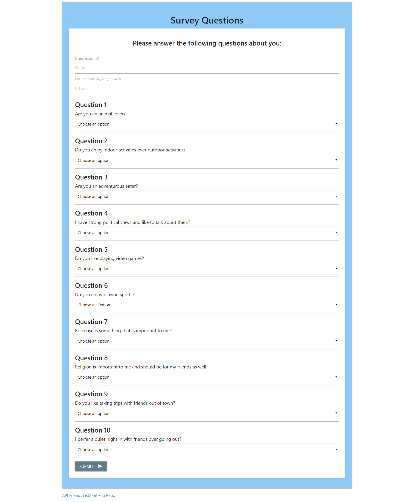

# Friend-Finder

### This was a homework asignment for the UCF Coding Boot Camp that demonstrates Node.js and Express.js. In this application the client fills in a 10 question survey and is then returned a new friend. This is also the first time that deployment to Heroku is utilized.

---

## Screenshots

## Technologies Used
* HTML
* JavaScript
* Node.js
* Express.js
* Materialize
* NPM packages
    * express
    * path
    * body-parser

## Try the Friend Finder Web Application

https://polar-cliffs-33407.herokuapp.com/